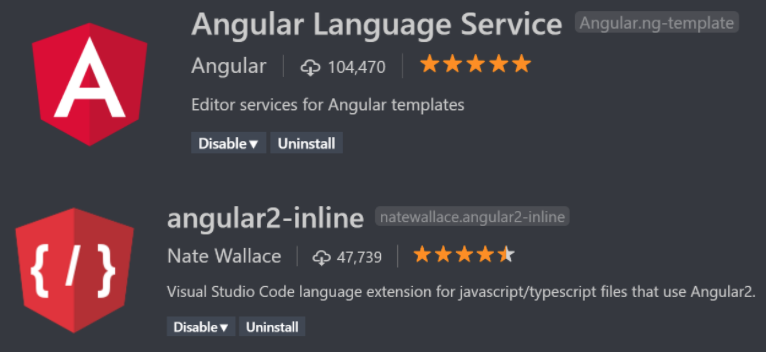
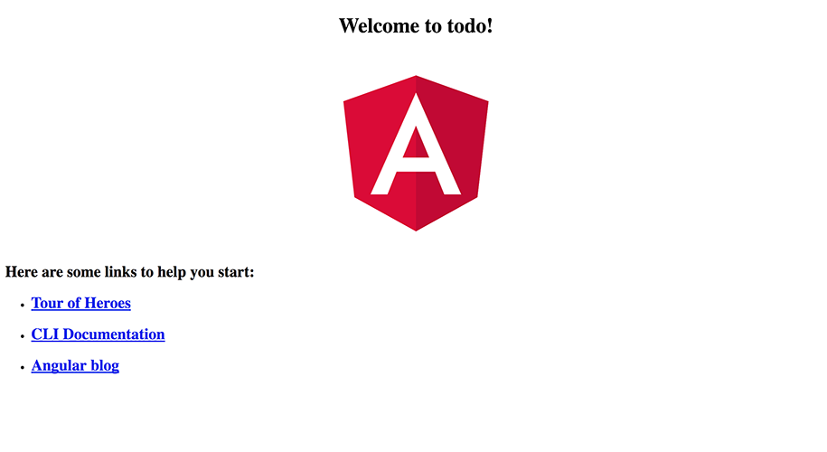

# Instalação

Toda desenvolvedora precisa de um conjunto de ferramentas e bibliotecas para começar a trabalhar. No nosso caso, vamos instalar todas as ferramentas necessárias, e uma vez que o Angular CLI esteja instalado, irá cuidar das bibliotecas adicionais que precisaremos para projetos atuais e futuros.

## Ferramentas

### Navegador (Browser)

Nossa primeira ferramenta é o **navegador** (browser). Iremos usar o navegador para ver o resultado do nosso trabalho e depurá-lo (debugar). Recomendamos o [Google Chrome](https://www.google.com/chrome/browser/desktop/) - que possui excelentes ferramentas para desenvolvedoras. O [Firefox](https://www.mozilla.org/en-US/firefox/new/) também é incrível. Se você ainda não possui algum desses instalados no seu computador, basta clicar no respectivo link e seguir as instruções para baixar e instalar o navegador de sua escolha.

### IDE

Nossa próxima ferramenta é a **IDE** - ambiente de desenvolvimento integrado. É um software que nos ajuda a escrever o código. IDEs podem fazer muitas coisas incríveis, tais como:

* deixar o código colorido, que facilita identificar expressões
* sugerir códigos enquanto você digita (auto-completar)
* ajudar a navegar facilmente entre arquivos do seu projeto
* e muito mais...

JetBrains [Webstorm](https://www.jetbrains.com/webstorm/download/) é uma das IDE mais populares do mercado. Você pode usar durante primeiro mês de graça, e caso seja estudando a licença é totalmente gratuita.

Microsoft [Visual Studio Code](https://code.visualstudio.com/) também é uma ótima escolha que tem ganhado muita popularidade ultimamente. É completamente gratuito.

Escolha a IDE com a qual deseja trabalhar e siga as instruções de instalação no respectivo site.

**Visual Studio Code**

Se optar por usar o VSCode, recomendamos instalar os seguintes Plugins para Angular:

- [Angular.ng-template](https://marketplace.visualstudio.com/items?itemName=Angular.ng-template)
- [natewallace.angular2-inline](https://marketplace.visualstudio.com/items?itemName=natewallace.angular2-inline)



### Git

O Git é uma ferramenta que ajuda a gerenciar versões do seu código e trabalhar de forma colaborativa com outros membros da equipe. Existe muita coisa para se aprender sobre Git, porém, neste tutorial vamos abordar apenas o uso básico.

Você pode baixar o Git e seguir as instruções de instalação clicando [aqui](https://git-scm.com/).
Quando o assistente de instalação perguntar se você gostaria de instalar o **git bash**, escolha sim.

### Github

[Github](https://github.com/) é um site de repositórios de código, que se integra com o Git. Permite publicar seu projeto na Web, copiar outros projetos de código aberto e colaborar. Para poder publicar seu projeto, certifique-se de criar um usuário no site do Github (gratuitamente, é claro).

### NodeJS e NPM

**Verifique a [documentação do Angular CLI](https://github.com/angular/angular-cli#prerequisites) para os pré-requisitos atualizados!**

Outra ferramenta que a maioria dos desenvolvedores web usam é o **NodeJS**. Uma vez instalado, ele vem com outra ferramenta chamada **NPM** (Node Package Manager - Gerenciador de Pacotes do Node).

O NodeJS permite que você execute código JavaScript em seu computador. Ele é usado para executar um servidor local que serve os arquivos do projeto no navegador e simula um verdadeiro site em execução.

O NPM permite que você baixe e instale facilmente bibliotecas diferentes da internet e gerencie suas versões.

Faça download do NodeJS [aqui](https://nodejs.org/en/).

Se você já possui o NodeJS instalado, verifique se a versão é 6.9.0 ou superior executando o comando abaixo em sua linha de comando (cmd) ou terminal:

```
node -v
```
\('-v' significa 'versão'.\)  

Se a sua versão for menor do que a versão necessária, faça download da versão mais nova do site do NodeJS e faça sua instalação.

Uma vez que o Node seja instalado, você também deve ter o NPM instalado. Verifique sua versão executando:

```
npm -v
```

### Angular-CLI

[Angular-CLI](https://github.com/angular/angular-cli) é uma ferramenta poderosa que simplifica muito processo de desenvolvimento. O CLI também instala bibliotecas que você usará em seus projetos atuais e futuros. Instale-o executando o seguinte comando:

```
npm i -g @angular/cli
```

Este comando executa o NPM que recentemente instalamos aqui - o NPM sabe onde encontrar o pacote (angular-cli) que você está procurando pelo nome do pacote que você digita.
O parâmetro 'i' é uma forma curta de 'instalar'.
o parâmetro '-g', representa a palavra 'global' - gostaríamos de ter esta ferramenta globalmente instalada no computador, para que possamos usá-la em qualquer pasta para criar projetos futuros.

Leia mais sobre Angular-CLI na seção a seguir.

### Criando um Projeto

Primeiro, crie uma pasta (diretório) para armazenar todos os seus projetos, por exemplo, _meusProjetos_ (de preferência sem espaços no nome), e depois entre na pasta, usando um terminal (janela de linha de comando):

```
cd caminho-para-sua-pasta/meusProjetos
```

Agora, crie um novo projeto, chamado _todo-list_ dentro da pasta de projetos, usando Angular-CLI, executando o seguinte comando:

```
ng new todo-list --prefix=todo
```

Esse comando pode demorar um pouco, uma vez que muitos pacotes estão sendo baixados e instalados.
O prefixo 'todo' será usado em todos os componentes que criamos. O prefixo padrão (se você não usar o sinalizador `--prefix`) é 'app'.

Agora, mude o diretório do terminal para a pasta que o CLI criou:

```
cd todo-list
```

Uma vez dentro do diretório do aplicativo, execute o aplicativo usando o seguinte comando:

```
ng serve -o
```

O sinalizador (flag) `-o` é uma abreviação para `--open`, que abrirá seu navegador na URL: [`localhost: 4200`](http://localhost:4200)

Você deverá ver uma página como esta:



### Parabéns!

Você tem uma aplicação angular em execução! **Enquanto você estiver trabalhando no aplicativo, você deve manter o terminal aberto executando o comando anterior.** Qualquer alteração que você fizer no código do projeto será refletida imediatamente no navegador.
Você pode abrir outro terminal para executar tarefas em paralelo.

Para parar o comando em execução no terminal, pressione `ctrl + c` no terminal ou feche o terminal.

Agora estamos prontas para começar a desenvolver!
